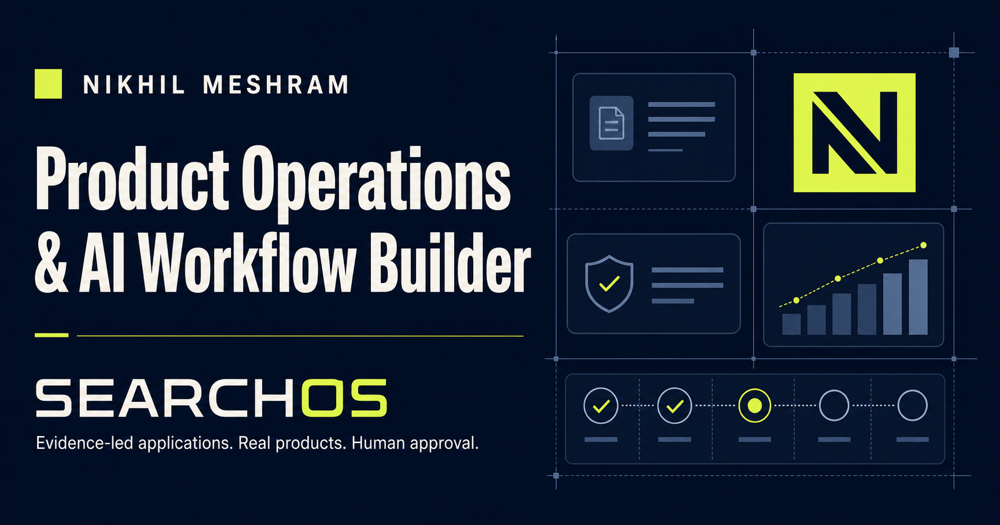

# SearchOS

**An evidence-led control plane for a more disciplined job search.**



SearchOS turns a scattered application process into a visible, reviewable
workflow. It brings job intake, fit scoring, evidence selection, approval gates,
and pipeline tracking into one product.

This repository contains the runnable product prototype and a recruiter-facing
portfolio route. The current MVP is intentionally local-first: it uses
deterministic scoring and browser storage, making every recommendation
inspectable and keeping the final decision with the applicant.

## The problem

High-volume job applications tend to fail in predictable ways:

- roles are pursued without a consistent fit test;
- resumes and outreach drift away from verified evidence;
- application status disappears across tabs and spreadsheets;
- automation encourages volume while removing human judgment.

SearchOS treats the job search as an operating system rather than a form-filling
exercise.

## What it does

- Captures a role and job description.
- Scores fit across role family, capabilities, domain, location, seniority, and
  explicit risk penalties.
- Explains every score with a visible breakdown, strengths, gaps, and a
  recommended decision.
- Routes each role to the Product & Business Operations or AI Workflow &
  Product CV track.
- Separates strong, review, and low-fit opportunities.
- Maintains a human approval queue before any application action.
- Tracks applications through a visible pipeline.
- Manages a product evidence library with public/draft controls.
- Selects only public, verified product evidence such as PowerCost Lab,
  Inkwell, and SearchOS.
- Creates a copyable decision packet with an approval checklist.
- Provides a dedicated recruiter portfolio at `/portfolio`.
- Persists edits locally in the browser.

## Product principles

1. **Evidence before claims** — metrics and products must be verified.
2. **Human approval before action** — the system prepares; the user decides.
3. **Explainable scoring** — the MVP avoids opaque ranking.
4. **Quality over volume** — poor-fit applications are deprioritized.
5. **Drafts stay private** — unverified products are not shown publicly.

## Current scope

The current layer implements manual role intake, deterministic qualification,
evidence selection, approval, and outcome tracking. It does not submit
applications, scrape job boards, or call an external AI service. Discovery
connectors and follow-up scheduling remain separate layers behind explicit
permission, privacy controls, and review gates.

## Run locally

Requirements: Node.js 22 or newer.

```bash
npm install
npm run dev
```

Open [http://localhost:3000](http://localhost:3000).

For a production build:

```bash
npm run quality
npm start
```

## Technology

- Next.js
- React
- TypeScript
- Tailwind CSS
- Local browser storage

## Product direction

The next extensions are approved role-source connectors, structured resume
variants, approval-based outreach generation, follow-up scheduling, conversion
analytics by channel, and AI-assisted tailoring constrained to the verified
evidence library.

## About

Designed and built by **Nikhil Meshram**, a Product Operations and AI Workflow
Builder with experience across logistics, B2B operations, workflow design, and
cross-functional execution.

- [LinkedIn](https://www.linkedin.com/in/nikhilmeshram31)
- [GitHub profile](https://github.com/nikhilmeshramwork-bot)

This public repository is shared for portfolio review. No license is granted for
commercial reuse.
